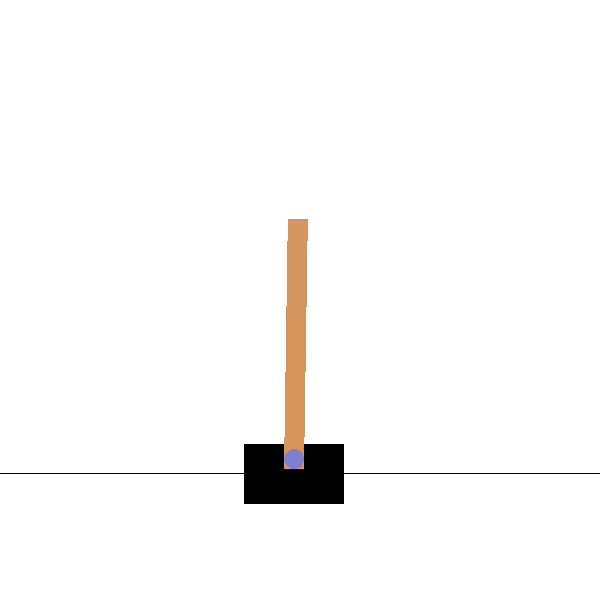
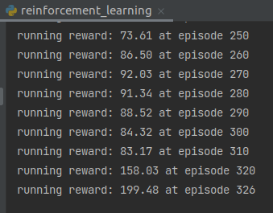

<h1>CartPole_AnyLogic_test</h1>

<h1>Idea</h1>

*  Запускается Java машина с окружением CartPole, используя Py4j
*  Питон скрипт создает и обучает агента обучения с подкреплением, обращаясь к окружению CartPole в Java через Py4j.
*  В Агенте используется метод DQN. 
 

<h1>Install</h1>
<h4>Java</h4>
mvn install
<h4>python install requirements</h4>
pip install -r python/requirements.txt

<h1>Run</h1>
<h4>Start Java env</h4>
mvn clean compile exec:java
<h4>Create and train new model on python</h4>
python python/reinforcement_learning.py

color: #DD80CC

